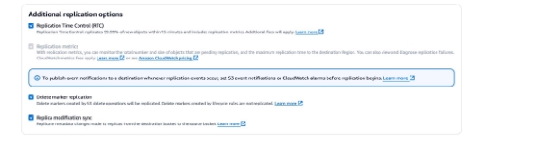
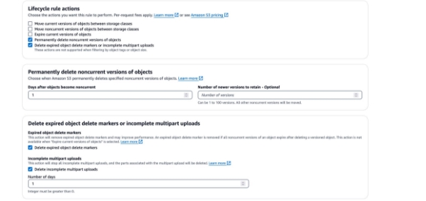

# Cross-Region Disaster Recovery Sample for Iceberg & Delta Lake

This guide will help you set up a cross-region disaster recovery (DR) solution for Iceberg and Delta Lake tables using Amazon S3 buckets in different regions. The setup involves creating S3 buckets, enabling versioning, configuring replication rules, setting up deletion lifecycle policies, and using an AWS Glue Notebook

## Prerequisites

Before you begin, ensure that you have the following:

- An AWS account with appropriate permissions to create and manage S3 buckets, enable versioning, configure replication rules, and set up deletion lifecycle policies.
- Access to the AWS Management Console or AWS Command Line Interface (CLI).

## 1. Create Amazon S3 Buckets

1. Log in to the AWS Management Console and navigate to the Amazon S3 service.
2. Create an S3 bucket in the primary region where you plan to store your Iceberg or Delta Lake data. For example, `my-primary-bucket`.
3. Create another S3 bucket in a different region, which will serve as the secondary or disaster recovery region. For example, `my-secondary-bucket`.

## 2. Enable Versioning

Versioning is essential for data recovery in case of accidental deletion or corruption.

1. In the Amazon S3 console, navigate to the `my-primary-bucket` bucket properties.
2. Choose the "Properties" tab, and then click on "Versioning."
3. Enable versioning by selecting the "Versioning" option and clicking "Enable."
4. Repeat the same steps for the `my-secondary-bucket` bucket.

## 3. Add Replication Rule in Source Bucket

Replication ensures that your data is automatically copied from the primary bucket to the secondary bucket in a different region, providing data redundancy and disaster recovery capabilities.
  

1. In the Amazon S3 console, navigate to the `my-primary-bucket` bucket properties.
2. Choose the "Replication" tab, and then click "Create replication rule."
3. In the "Replication rule" wizard, follow the on-screen instructions to set up replication from the `my-primary-bucket` to the `my-secondary-bucket`.
4. Review the replication rule configuration and click "Create rule."

## 4. (Optional) Configure Bidirectional Replication

If you want to set up a fail-back scenario, you can configure bidirectional replication between the source and target buckets. This ensures that changes made in either bucket are synchronized with the other bucket.

1. Follow the steps in section 3 to create a replication rule from the `my-secondary-bucket` to the `my-primary-bucket`.
2. S3 objects have a replication metadata tag, so there won't be any duplicate or loop scenarios during bidirectional replication.

## 5. Configure Deletion Lifecycle Policy

To manage storage costs when delete or vacuum operations are performed on Iceberg or Delta Lake tables, you can configure a deletion lifecycle policy in both the source and target buckets.

1. In the Amazon S3 console, navigate to the `my-primary-bucket` bucket properties.
2. Choose the "Lifecycle" tab, and then click "Create rule."
3. In the "Lifecycle rule" wizard, follow the on-screen instructions to configure the deletion policy.
   - Specify the number of non-current versions you wish to delete and the number of days after which the versions should be deleted.
   - Check the option to delete expired delete markers and incomplete multipart uploads.
4. Review the lifecycle rule configuration and click "Create rule."
  

## 6. Repeat Step 5 for Target Bucket

Repeat step 5 to configure the deletion lifecycle policy for the `my-secondary-bucket` as well.

## 7. Spin up a Glue Notebook

AWS Glue Notebooks provide an easy way to run Apache Spark code and manage your Iceberg or Delta Lake.

1. Log in to the AWS Management Console and navigate to the AWS Glue service.
2. Choose "Notebooks" from the left-hand menu, and then click "Create notebook."
3. Provide a name for your notebook and choose an appropriate IAM role with the necessary permissions.
4. Upload a notebook file containing the code to set up and manage your Iceberg or Delta Lake infrastructure.
5. Run the notebook to create, manage, and query your Iceberg or Delta Lake tables across the primary and secondary regions.

By following these steps, you have set up a cross-region disaster recovery (DR) solution for Iceberg and Delta Lake tables using Amazon S3 buckets in different regions. The setup includes versioning, replication, and deletion lifecycle policies configured for data redundancy, disaster recovery, and cost management. The Glue Notebook provides a way to manage the infrastructure and query the tables across regions.
